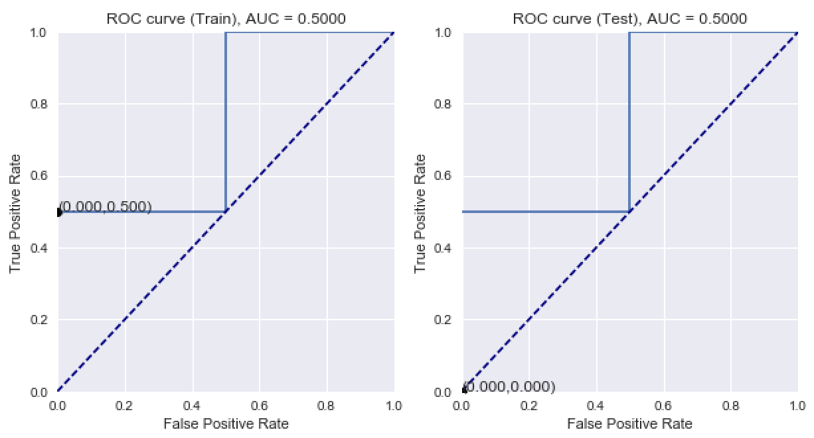

# ROC

A small package to plot the ROC (Receiver Operating Characteristics) graph in python.

In statistics, a receiver operating characteristic curve, i.e. ROC curve, is a graphical plot that illustrates the diagnostic ability of a binary classifier system as its discrimination threshold is varied. (wiki)

This function returns the best threshold derived from the training data set based on highest sensitivity+specificity in the training dataset.

It also gives useful information such as the 

```python
plot_ROC(y_train_true, y_train_prob, y_test_true, y_test_prob)
```

Parameters: 

`y_train_true`: array, shape = [`n_train_samples`], True binary labels of 0 or 1 in the training dataset

`y_train_prob`: array, shape = [`n_train_samples`], Probability in range {0,1} predicted by the model for the training dataset

`y_test_true`: array, shape = [`n_test_samples`], True binary labels of 0 or 1 in the testing dataset

`y_test_prob`: array, shape = [`n_train_samples`], Probability in range {0,1} predicted by the model for the testing dataset

Return:


Example:

```python
import roc
y_train_true = np.array([0,0,1,1])
y_train_prob = np.array([0.1, 0.4, 0.35, 0.8])
y_test_true = np.array([0,1,0,1])
y_test_prob = np.array([0.2,0.3,0.4,0.6])
best_threshold = roc.plot_ROC(y_train_true, y_train_prob, y_test_true, y_test_prob)
```

```python
Train Accuracy: 0.5
Train AUC: 0.5 
Train Confusion Matrix:
[[2 0]
 [2 0]]
Test Accuracy: 0.5 
Test AUC: 0.5 
Test Confusion Matrix:
[[2 0]
 [2 0]]
```

